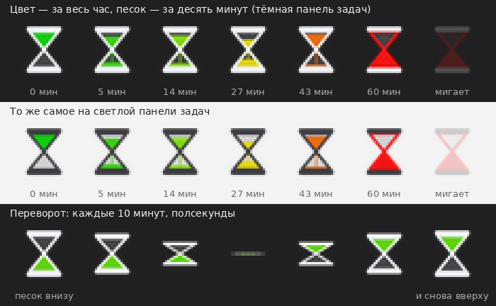

# Timerlight

Маленькие песочные часы в трее Windows 11. Они показывают, сколько времени вы
непрерывно сидите за компьютером: цвет песка идёт от зелёного к красному за весь
час, а сам песок пересыпается за десять минут, после чего часы переворачиваются
и всё начинается заново. Когда час истёк — значок начинает мигать.

Щелчок левой кнопкой по значку сбрасывает отсчёт.



## Две шкалы в одном значке

- **Цвет — это час.** Зелёный держится примерно до 20 минут, жёлтый приходится
  на середину, оранжевый — ближе к 45 минутам, красный — к самому концу. Цвет
  показывает долю интервала, поэтому при другом интервале шкала растянется или
  сожмётся вместе с ним.
- **Песок — это десять минут.** За десять минут он полностью пересыпается вниз,
  часы переворачиваются, и песок снова начинает падать. Так значок остаётся
  живым, а не стоит неподвижно целый час.

Переворот — это не подмена картинки, а короткая анимация: часы сплющиваются по
вертикали, проходят через положение «ребром» и возвращаются перевёрнутыми,
примерно за полсекунды. Фигура симметрична относительно горлышка, поэтому
последний кадр переворота в точности совпадает с началом новой десятиминутки —
стыка не видно.

Когда час вышел, значок мигает — попеременно то виден, то почти прозрачен, — и
стекло часов тоже становится красным. Мигание не прекращается, пока вы не
сбросите таймер.

## Как пользоваться

| Действие | Что происходит |
| --- | --- |
| Левая кнопка по значку | Сбросить таймер и начать час заново |
| Правая кнопка по значку | Меню: интервал, переворот, пауза, настройки, выход |
| Наведение курсора | Подсказка вида «За компом 42 мин из 1 ч» |

> [!IMPORTANT]
> Windows 11 по умолчанию прячет новые значки в «карман» — стрелочку слева от
> часов. Пока значок спрятан, мигания вы не увидите. Вытащите его на панель
> задач: **Параметры → Персонализация → Панель задач → Другие значки в области
> уведомлений → Timerlight → Вкл.** Либо просто перетащите значок из «кармана»
> на панель задач мышью.

## Установка

Готовый `Timerlight.exe` собирается в GitHub Actions: откройте вкладку
**Actions**, выберите последнюю сборку и скачайте артефакт `Timerlight-win-x64`.
Это самодостаточный файл — .NET ставить не нужно, программа не требует установки
и прав администратора. Положите его в любую папку и запустите.

Чтобы программа запускалась сама после перезагрузки, включите в меню значка
пункт **«Запускать вместе с Windows»**.

## Настройки

Всё настраивается из меню по правой кнопке:

- **Интервал** — 15, 30, 45, 60, 90, 120 минут или свой, до 24 часов. По умолчанию час.
- **Переворот часов** — как часто песок пересыпается заново: 5, 10, 15, 20, 30
  минут или «без переворота», когда песок растягивается на весь интервал.
  По умолчанию 10 минут.
- **Сброс при бездействии** — если вы не трогали мышь и клавиатуру дольше
  заданного времени, значит, вы отошли и отсчёт начинается заново. По умолчанию
  10 минут; можно выключить.
- **Мигать по достижении** — отключает мигание, если оно раздражает.
- **Показывать уведомление** — всплывающее уведомление Windows в момент, когда
  интервал вышел. Показывается один раз за цикл.
- **Сбрасывать после разблокировки** и **Сбрасывать после сна** — начинать час
  заново, когда вы вернулись к заблокированному или спящему компьютеру.
- **Пауза** — остановить отсчёт, не сбрасывая его. Песок становится серым.

Настройки хранятся в `%APPDATA%\Timerlight\settings.json` и переживают
перезапуск. Испорченный файл не мешает запуску — программа просто вернётся
к значениям по умолчанию.

## Сколько это ест ресурсов

Почти ничего. Всё в значке считается в целых минутах, поэтому программа
просыпается **раз в минуту** — и не просто каждые 60 секунд, а ровно на границе
очередной минуты отсчёта, чтобы уровень песка и переворот происходили вовремя,
а не уплывали вместе с таймером.

Чаще она просыпается только в двух случаях: полсекунды на анимацию переворота
раз в десять минут и мигание в конце интервала, пока вы не сбросите таймер.
Кроме того, значок перерисовывается только тогда, когда картинка действительно
меняется — одинаковые кадры отбрасываются до отрисовки.

## Сборка из исходников

Нужен [.NET 8 SDK](https://dotnet.microsoft.com/download/dotnet/8.0).

```powershell
dotnet publish src\Timerlight\Timerlight.csproj -c Release -r win-x64 `
  --self-contained true -p:PublishSingleFile=true -p:EnableCompressionInSingleFile=true `
  -o publish
```

Готовый файл окажется в `publish\Timerlight.exe`.

Проект собирается и с Linux или macOS (в csproj включён `EnableWindowsTargeting`),
что и делает workflow в `.github/workflows/build.yml`.

## Как устроено

| Файл | Зачем |
| --- | --- |
| `src/Timerlight/Program.cs` | Точка входа, защита от второго запуска |
| `src/Timerlight/TrayApplicationContext.cs` | Значок, меню, отсчёт, переворот, реакция на простой, блокировку и сон |
| `src/Timerlight/HourglassIconRenderer.cs` | Рисование песочных часов |
| `src/Timerlight/AppSettings.cs` | Чтение и запись `settings.json` |
| `src/Timerlight/Autostart.cs` | Запись в ветку реестра `Run` |
| `tools/generate_icon.py` | Генерация `timerlight.ico` — значка самого exe |
| `tools/generate_preview.py` | Генерация `docs/preview.png` для этого README |

Форма часов задана на условном холсте 100×100 и масштабируется под тот размер,
который просит система, — поэтому значок остаётся чётким и при 100 %, и при
150 % масштабе. Уровень песка считается по площади: верхняя колба —
треугольник, стоящий на вершине, поэтому высота песка в ней пропорциональна
корню из оставшейся доли, а не самой доле.

Переворот сделан сжатием по вертикали, а не поворотом: настоящий поворот на 45°
вынес бы углы фигуры за пределы значка, а сжатие остаётся внутри квадрата при
любом угле — и выглядит как часы, качнувшиеся в подставке.

Цвет стекла подстраивается под тему панели задач: тёмное стекло на светлой
панели, светлое — на тёмной.

Скрипты в `tools/` нужны только для пересборки картинок, на сборку программы они
не влияют:

```bash
pip install Pillow
python3 tools/generate_icon.py
python3 tools/generate_preview.py
```

## Что дальше

То, что могло бы появиться в программе, вместе с причинами, собрано в
[`docs/ideas.md`](docs/ideas.md). Это не план работ, а копилка идей: оттуда они
уходят в issues и в код.
